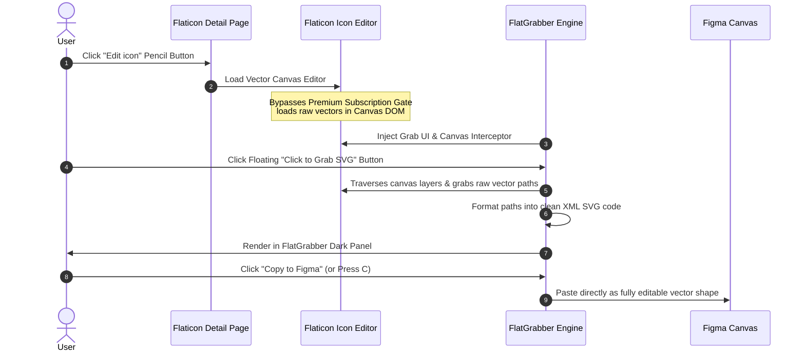

# ⚡ FlatGrabber: Premium Flaticon SVG Extractor & Figma Bridge

[](https://developer.chrome.com/docs/extensions/)
[](https://opensource.org/licenses/MIT)
[](https://www.w3.org/Graphics/SVG/)
[](https://figma.com)

A premium, developer-focused Google Chrome extension engineered to inspect, edit, recolor, bulk package, and extract clean high-fidelity vector SVGs directly from Flaticon. FlatGrabber features a seamless Figma clipboard bridge, enabling designers and developers to copy raw vector codes and paste them directly into Figma as fully editable vector shapes.

---

## 🚀 Key Features

*   **⚡ Smart Hover Grabber:** Non-intrusive hover triggers positioned intelligently above Flaticon grid elements to avoid blocking website controls or overlapping adjacent icon rows.
*   **🎨 Instant Vector Recolor:** Dynamically edit colors of single icons or your entire saved collection in real time directly from the extension's panel before exporting.
*   **✨ Bulletproof Figma Bridge:** Copy vector codes with one click (`Copy` button or `C` shortcut) and paste them directly into Figma as fully editable vector layers.
*   **🔥 Figma Grid Packager:** Copies your entire saved collection as a single, beautifully structured coordinate grid. Paste it directly into Figma to populate your canvas instantly.
*   **📦 Parallel Bulk Grabber ("Grab Page"):** Grab all icons on the page concurrently with an animated progress pipeline.
*   **💾 Offline ZIP Archiver:** Instantly compress and download your entire collection as beautifully categorized, optimized vector files locally.
*   **🏁 Checkerboard Previews:** Custom transparency checkerboard backgrounds in the preview canvas and grid items so both pure white and pure black icons stand out.
*   **🔒 Smart Vector Status Indicator:** Automatically detects if an icon is PNG-only or Vector. If vector data is unavailable, it disables the SVG tab and provides clear tooltips to prevent empty clipboard errors.

---

## ⚙️ How the Premium SVG Interception Works

Flaticon natively restricts direct access to high-fidelity vector files for free accounts on search/modal grid screens. This extension bypasses that limitation using a built-in canvas scraping technique inside Flaticon's own **Icon Editor**. 



---

## 🔥 The Secret Unlocking Hack (Step-by-Step Guide)

To extract clean, unwatermarked vectors for **any** vector-compatible icon, follow this simple procedure:

1.  **Open Details:** Click on any icon to open its standard detail page.
2.  **Click "Edit icon":** Click the colorful **🎨 Edit icon** pencil button above the main preview image.
3.  **Grab from Editor:** Once the canvas editor loads, hover over the icon and click the floating **"Click to Grab SVG"** badge.
4.  **Vector Unlocked:** FlatGrabber instantly intercepts the editor's active canvas data and extracts the raw vector paths! The **SVG Code** tab will light up, ready for copy-pasting.

---

## 🛠️ Installation Guide

Follow these steps to load FlatGrabber locally in developer mode:

1.  **Download or Clone:** Clone this repository or download the ZIP file and extract it to a directory on your machine (e.g., `flat-grabber`).
2.  **Open Chrome Extensions:** In Google Chrome, navigate to `chrome://extensions/`.
3.  **Enable Developer Mode:** Toggle the **Developer mode** switch in the top-right corner.
4.  **Load Unpacked:** Click **Load unpacked** in the top-left corner.
5.  **Select Directory:** Choose the folder containing the extension's files (where the `manifest.json` is located).
6.  **Pin for Quick Access:** Pin the extension from your Chrome toolbar to begin grabbing.

---

## 📂 Project Architecture & Codebase Overview

```filepath
├── manifest.json         # Extension configuration, permissions & background mappings
├── content.js            # Capture-phase click interceptors, canvas parsers & UI pipeline
├── styles.css            # Premium dark-theme glassmorphism layout & animations
├── background.js         # Port listener bypass for secure CDN vector fetching
├── popup.html            # Extension action popup UI (with UTF-8 support & interactive guide)
├── popup.js              # Native Chrome tab handlers for the popup launch action
├── jszip.min.js          # Fast offline ZIP generation library
└── icon.png              # Extension branding icons
```

### Script-by-Script Breakdown
*   **`manifest.json`**: Explicitly declares extension permissions (`activeTab`, `clipboardWrite`, `scripting`) and hooks up the content scripts to only run when the user is on Flaticon.
*   **`content.js`**: The brains of the extension. Operates a heavy-duty listener network, intercepts custom Flaticon DOM events using capture-phase interception (`{ capture: true }`), scrapes the inline canvas elements, compiles raw SVG coordinates, recolors layers, and drives the Figma clipboard formatter.
*   **`styles.css`**: Supplies premium dark glassmorphic components, custom scrollbars, animated loading pipelines, and the checkerboard canvas previews.
*   **`background.js`**: Works in the background to handle bypass routes and fetch remote SVGs securely when direct client requests are blocked by CORS.
*   **`popup.html` & `popup.js`**: Provide the user-facing dropdown instructions and action buttons when they click the extension icon in the Chrome toolbar.

---

## ⌨️ Developer Keyboard Shortcuts

Speed up your design system workflow with built-in instant hotkeys (active whenever the FlatGrabber sidebar panel is open):

| Key | Action | Description |
| :--- | :--- | :--- |
| <kbd>I</kbd> | **Toggle Inspector** | Enables instant canvas highlighter mode to click-to-grab any icon. |
| <kbd>C</kbd> | **Copy Code** | Instantly copy active SVG code or PNG Image Tag to clipboard. |
| <kbd>S</kbd> | **Save Asset** | Save active asset into your local collection. |

---

## 🔍 Technical Deep-Dive

### 1. The Figma Clipboard Bridge Format
Figma does not accept raw string text as vectors. To make vectors pasteable directly onto the Figma canvas as fully editable vectors (rather than a raw code block), the extension wraps the standard SVG string in a specific custom MIME type wrapper (`text/html`) with standard HTML formatting tags:
```javascript
const figmaPayload = `<span class="svg-wrapper">${svgCode}</span>`;
```
When this payload is copied to the system clipboard, Figma parses the raw HTML wrapper, extracts the child SVG node, and reconstructs the coordinate nodes natively.

### 2. Capture Phase Event Interception
Flaticon uses heavy internal event listeners on grid icon containers to hijack clicks and route users to detail pages. To intercept a click on our custom floating "Grab" badge without triggering Flaticon's standard page routing, FlatGrabber registers click event listeners in the **Capture Phase** instead of the bubbling phase:
```javascript
element.addEventListener('click', grabHandler, { capture: true });
```
We then trigger `event.stopPropagation()` and `event.preventDefault()` to stop the event dead in its tracks before Flaticon's native routing scripts can even detect it.

---

## 📡 SEO Optimizations & Keywords

This repository is optimized for discoverability across search engines and developer ecosystems:
*   **Primary Keywords:** *Flaticon SVG Downloader, Figma Vector Bridge, Chrome SVG Grabber, Inline SVG Extractor, Chrome Extension SVG Parser, Extract SVGs to Figma, Recolor SVGs Online, Premium SVG Unlocker.*
*   **Compatible Browsers:** Google Chrome, Brave Browser, Microsoft Edge, Opera, Vivaldi, and other Chromium-based platforms.
*   **Figma Integration:** Fully matches Figma's desktop and web clipboard formats for zero-friction paste operations.

---

## 🤝 Contributing

Contributions, issues, and feature requests are welcome! Feel free to check the [issues page](../../issues).

1. Fork the Project
2. Create your Feature Branch (`git checkout -b feature/AmazingFeature`)
3. Commit your Changes (`git commit -m 'Add some AmazingFeature'`)
4. Push to the Branch (`git push origin feature/AmazingFeature`)
5. Open a Pull Request

---

## 📄 License

Distributed under the MIT License. See `LICENSE` for more information.
